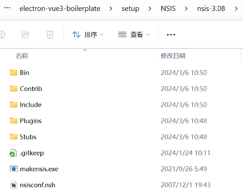
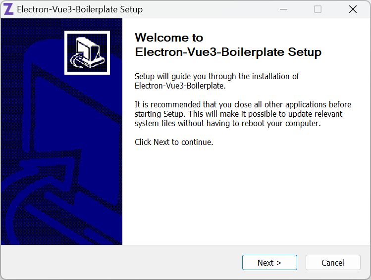
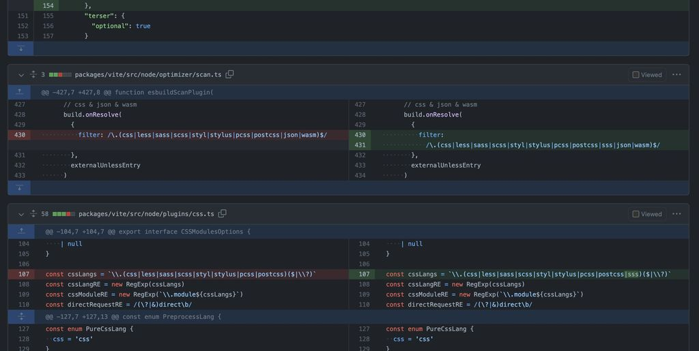

# 1. 写在前面
已经有了那么多的 Electron 项目模板，为什么还要再造一个？是重复造轮子吗？

我相信大多数人选择使用 Electron 开发客户端时，或多或少都看上了 Web 开发的高效率，但Web开发人员在客户端和系统编程方面的经验相对缺乏，又加上 Electron 和前端框架（如 Vue ）结合起来也不是那么的轻而易举，开发人员大多会选择基于模板来快速上手搭建Electron项目。

目前，Electron 的模板项目已经有很多，比较流行的有[electron-vite](https://github.com/alex8088/electron-vite)、[electron-vite-vue](https://github.com/electron-vite/electron-vite-vue)等。在这些模板中，有的功能过于完善，代码太复杂，远远超过了很多 Electron 客户端项目本身的代码量，需要花很多时间来熟悉模板，不适合新手快速上手和修改，一旦出现问题也难以维护；有的模板又年久失修，使用的技术早已被淘汰，也不适合用来开发线上产品，而且这些模板都有一个通病，都是在用Web开发的思维来开发客户端。

基于上述原因，我开发了这个 Electron 项目模板，在开发过程中，我一直遵循稳定、易于维护的初衷。

# 2. electron-vue3-boilerplate

基于 **Vue3** + **Electron** + **TypeScript** 的客户端程序模板，使用 **Vite** 和 **Electron Forge** 构建和打包。

真正做到开箱即用，面向跨平台客户端设计，产品级的项目模板。


## 2.1 特性

- 使用 [ViteJS](https://vitejs.dev) 构建和驱动前端页面，支持热加载（HMR），使开发和调试变得更加高效 ⚡
- 支持 Electron 窗口快捷创建指令，并且可隔离不同窗口的 IPC 事件 💖
- 封装简化了 IPC 的调用方式，并提供了 IPC 函数快速创建指令，主进程与渲染进程的相互调用从未如此简单（见`utils`库） 👍
- 主进程和渲染进程支持热加载 ⚡
- 精选依赖包，提升项目稳定性
- 代码简洁并附有完善地中文注释，易掌控，可定制性强
- 日志文件，主进程和渲染进程可以直接写文件日志
- 支持本地配置文件
- 主进程和渲染进程均支持 axios HTTP 请求
- 文件下载（多文件同时下载、哈希校验、进度反馈等），渲染进程可直接异步调用 👍
- 功能完善的无边框窗口
- 托盘图标和右键菜单，窗口关闭时程序最小化到托盘
- 客户端程序单实例
- 基于 ESLint 的代码规范和自动格式化
- 使用 Electron 官方推荐的[Electron Forge](https://www.electronforge.io/)进行客户端构建和打包
- 只打包必要的依赖组件，减少安装包体积，并精简 package.json 文件，防止信息泄露
- 支持 NSIS 安装包 😎
- ......

## 2.2 快速开始 🌈

点击右上角绿色的 **Use this template** 按钮，使用该模板创建一个新的仓库并克隆到本地。

**或者..**

直接克隆该项目: `git clone https://github.com/winsoft666/electron-vue3-template.git`

### 2.2.1 Visual Studio Code
推荐使用`Visual Studio Code`进行项目开发，并安装如下插件：

- ESLint
- Vue Language Features (Volar)

### 2.2.2 安装依赖 ⏬

```bash
yarn install
```

> 国内用户建议将 yarn 源设置为国内源，避免安装依赖失败，设置方法可以参考：[《NPM和Yarn设置国内源》](https://jiangxueqiao.com/post/908211703.html)

### 2.2.3 开发 ⚒️

```bash
yarn run dev # 以开发环境启动应用并支持热加载
yarn run test # 以测试环境启动应用并支持热加载
yarn run production # 以生产环境启动应用并支持热加载
```

### 2.2.4 其他命令

```bash
yarn run build # 构建应用，可发布的包位于"out\make"目录

# 或者
yarn run build:win32 # 构建Windows平台 32位应用
yarn run build:win64 # 构建Windows平台 64位应用
yarn run build:mac # 构建macOS平台应用
yarn run build:linux # 构建Linux平台应用

yarn run new:page  # 创建新的Vue页面
yarn run new:window # 创建新的Electron窗口
```

更多的可选配置项可以参考 [Electron Forge CLI docs](https://www.electronforge.io/cli)。

### 2.2.5 NSIS安装包 🪟
> 这一步是可选的。
> 
> NSIS 只支持生成 Windows 平台安装包，如果您不需要使用生成 NSIS 安装包，可以跳过该节。
> 
> 更多NSIS介绍，可以查看我的 NSIS 教程：[《打包狂魔之NSIS教程》](https://jiangxueqiao.com/post/4015642655.html)

**首先需要将`setup\NSIS\nsis-3.08.zip`文件解压到当前目录，即将文件释放到nsis-3.08目录，解压后的nsis-3.08目录结构如下：**



运行如下命令构建Windows平台 32位应用并使用NSIS生成安装包：

```bash
yarn run build:nsis-win32
```

运行如下命令构建Windows平台 64位应用并使用NSIS生成安装包：

```bash
yarn run build:nsis-win64
```

生成的安装包位于`setup\NSIS\`目录。

NSIS安装界面截图：



NSIS安装包支持完全定制化，如需定制，可以修改`setup\NSIS\win-setup-*.nsi`文件，但请注意NSIS脚本文件需要以ANSI编码格式保存。

# 3. 项目介绍
## 3.1 工程结构 🌳

```yaml
- scripts/         # 该目录中的脚本用构建应用程序和驱动前端页面
- screenshots      # 本文档中用到的截图
- setup/           # 存储编译和构建相关文件
  - NSIS/              # NSIS安装包脚本
    - install.ico        # NSIS安装包图标
    - uninstall.ico      # NSIS卸载程序图标
  - exe.ico            # 构建后的可执行文件图标（非安装包图标）
- src/
  - lib/            # 公共库，为了方便修改，未做成独立的包
    - file-download/   # 文件下载库
      - main             # 仅供主进程使用
      - renderer         # 仅供渲染进程使用
      - shared           # 主进程和渲染进程都可以使用
    - utils/           # 公共代码库
  - main/           # 主进程的代码 (Electron)
    - static/          # 静态资源
    - windows/         # 多窗口文件夹 (每个子目录表示一个窗口)
      - primary/         # 主窗口（客户端通常都会有一个主窗口）
      - frameless/       # 无边框示例窗口
      - ...
  - renderer/      # 渲染进程的代码 (VueJS)
    - public           # 静态资源
    - router           # 定义路由
    - typings/         # ts声明文件
    - views/           # 视图
      - primary.vue              # 主窗口
      - frameless-sample.vue     # 无边框示例窗口
      - ...
```

## 3.2 使用静态文件

- `src/main/static`目录存放主进程使用的静态文件。
- `src/renderer/public`目录存放渲染进程使用的静态文件。

#### 在主进程中引用静态文件

```ts
// 假设 src/main/static/tray.ico 文件存在
// 使用 appState.mainStaticPath 属性获取主进程的静态文件存储目录
import path from "path";
import appState from "./app-state";

const iconPath = path.join(appState.mainStaticPath, "tray.ico");
```

## 3.3 AppState对象
为了方便在主进程中跨模块访问某些对象（如`primaryWindow`、`tray`、`cfgStore`等）和应用配置（如`onlyAllowSingleInstance`等），我们定义了单实例对象AppState 来存储这些数据。

使用方法如下：

```javascript
import appState from "./app-state";

appState.primaryWindow?.show();
```

更多与应用有关的对象和配置，请查看 [app-state.ts](./src/main/app-state.ts)

### 3.3.1 应用环境

本模板预置了三种应用环境：开发环境、测试环境、生产环境，在Electron和Vue均可获取当前运行环境：

```javascript
// Electron
appState.appEnv

// Vue
import.meta.env.MODE
```

### 3.3.2 环境变量

如果需要针对不同应用环境为 Vue 添加环境变量，可以在`scr\renderer\.env.*`文件中添加，如：

```javascript
// .env.development
VITE_BASE_URL=http://127.0.0.1/api/dev/base/url/
```

## 3.4 快速创建Electron窗口
虽然直接创建 Electron 窗口并非难事，直接创建一个 BrowerWindow 对象就可以创建一个新的 Electron 窗口，但为了方便代码管理和 ipcMain 消息的隔离，本模板中的每个窗口都继承自`WindowBase`对象，每个窗口的相关代码都位于 `src\main\windows\` 的不同子目录中，目录名为我们指定的窗口名称（小写）。

```bash
yarn run new:window
```

需要手动修改窗口对应的路由路径：

```javascript
this.openRouter("/ROUTER-PATH");
                     ~~~~~~~~~~~
```

创建窗口后，需要在`registerIpcMainHandler`方法中注册该窗口的ipcMain事件及处理函数。

每个窗口暴露到渲染进程的 apiKey 都不一样，如 primaryWindow：

```javascript
contextBridge.exposeInMainWorld("primaryWindowAPI", {
  ...
}
```

这样就不用担心多个窗口注册了同名的事件时，渲染进程发送该名称的事件到主进程，所有窗口对象都收到该事件通知。（Electron 22 无效，仍需全局唯一事件名）

## 3.5 快速创建IPC函数
在`src\renderer\pages\primary\App.vue`中获取文件 MD5 的代码如下：

```javascript
async function onGetFileMd5(){
  const result = await utils.showOpenDialog({
    properties: [ "openFile" ],
    filters: [
      { name: "All Files", extensions: [ "*" ] }
    ]
  });

  if(result.filePaths.length > 0){
    utils.getFileMd5(result.filePaths[0])
      .then((md5) => {
        message.success(md5);
      }).catch((e) => {
        message.error(GetErrorMessage(e));
      });
  }
}
```

上述代码通过调用 Utils 库的`showOpenDialog`、`getFileMd5`函数轻松实现了通知主进程选择文件、计算文件 MD5 并获取相应结果的操作，代码非常简洁。

但是 Utils 只预置了部分常用的功能，预置功能肯定无法满足我们产品开发的所有需求。在此情况下，我们可以向 Utils 库中添加自定义的功能函数，该如何添加了？

不用担心，本模板已经提供了 IPC 函数快速创建指令：

```bash
yarn run new:ipc
```

执行上面指令后，会出现如下提示：
```txt
创建语法: 调用方向,函数名称,函数类型
调用方向:
        rm = 渲染进程调用主进程的函数
        mr = 主进程调用渲染进程的函数（忽略函数类型）
函数名称:
        xxx-xxx-xxx
函数类型:
        a = 异步调用, 不带返回值
        ap = 异步调用, 带 Promise 类型的返回值
        s = 同步调用, 带返回值
输入指令:
```

参数1（调用方向）表示函数调用方向：
- rm 表示渲染进程调用主进程的函数，可以支持同步调用、异步调用，并且可以返回 Promise 结果。
- mr 表示主进程调用渲染进程的函数，该方向只能是异步调用，而且不支持返回结果，会忽略第三个参数（函数类型）。

参数2（函数名称），函数名称的单词间使用`-`分隔，如`GetFileSha256`需要指定为`get-file-sha256`。

参数3（函数类型）：
- a 表示不返回结果的异步函数
- ap 表示返回 Promise 结果的异步函数
- s 表示同步函数


### 示例
依次输入如下命令：
```bash
yarn run new:ipc

输入指令:
rm,get-file-sha256,ap
```

命令执行成功后，会自动在`src\lib\utils\renderer\index.ts`生成`Utils.getFileSha256`函数：

```javascript
public async getFileSha256(){
  return await (window as any).__ElectronUtils__.getFileSha256();
}
```

自动生成的函数都没有指定参数和返回值，需要我们手动添加，如修改后的函数如下：

```javascript
public async getFileSha256(filePath: string) : string {
  return await (window as any).__ElectronUtils__.getFileSha256(filePath) as string;
}
```

在渲染进程中（如App.vue）中可以直接调用该函数：

```javascript
import utils from "@utils/renderer";

const sha256 = await utils.getFileSha256("file-path.txt");
```

IPC函数创建指令只会创建函数骨架，不会为我们实现具体的功能，我们还需要在主进程ipcMain处理函数中实现计算文件 SHA256 的具体功能。

自动生成的主进程 ipcMain 处理函数如下：

```javascript
ipcMain.handle("electron-utils-get-file-sha256", async(event) => {
});
```

手动添加参数、返回值，及具体的功能代码（此处省略）：

```javascript
ipcMain.handle("electron-utils-get-file-sha256", async(event, filePath: string) : Promise<string> => {
  // .....
});
```

## 3.6 Debug
由于本模板使用的是脚本启动，因此调试main process时不能调试源码

1. 使用外部调试工具。
  
> script: `"dev": "node scripts/dev-server.js development --inspect=9229"`

> 浏览器地址栏中输入 `chrome://inspect`

> 然后点击 `Open dedicated DevTools for Node`

2. vscode
   
> script: `"dev": "node inspect scripts/dev-server.js development",`

> 然后debug运行


# 4. 代码规范
本项目使用 ESLint 进行代码检查和格式化，没有使用 Prettier 进行代码格式化。

原因大体如下：
1. 需要额外的插件和配置来避免 ESLint 和 Prettier 的规则冲突。

2. Prettier的`printWidth`配置项会损害代码和 Git Diff 的可读性。



[在线演示](https://prettier.io/playground/#N4Igxg9gdgLgprEAuc0DOMAEBXNcBOamAvJgNoA6UmmwOe+AkgCZKYCMANPQVAIYBbOGwogAggBsAZgEs4mAMJ98QiTJh9RmAL6cqNOrgIs2AJm5H8-ISJABxGf0wAlCGgAWfKFt37aPJlZMAGYLBmthTFEAZXdsAHNMADk+ACNsHz1qf0sTTAAWMN5BSNFnPncBL0wAMXw+Bky-QwY8gFYiqxLbABU3d3kAGQBPbFSEJuyW4yCANk6I22iCeJkIZJkJCCllSYBdAG4qEE4QCAAHGDWoNGRQZXwIAHcABWUEW5Q+CSe+YdvTql6mAANZwGDREqDRxwZA7CR4QHAsEQ858MCOeLIGD4bBwU5wATjZjMODMQZeeLYPjxOA1CAqPgwK5QLFfbAwCAnEDuGACCQAdXc6jgaDRYDgyxu6hkADd1MNkOA0ACQI4GDAXvV4lU4d9ESAAFZoAAe0UxEjgAEVsBB4HqEfiQGjCAQlak0nAJNzzvhHDABTJmDB3Mh8uZnY88AL6uclb7RQRZbDTgBHW3wLUXT4gBoAWigcDJZO5+Dg6ZkZa1NN1SHhBrwAhk2NxTrQFutGdhdf1To0qUDwdDSAjOL4m0xCggAlrIFFbW5Rh6aU+9adsrxjCgpNg0TAfsuYm30Rgw0tDrw2m0QA)

# 5. 依赖包 🎈
## 5.1 基本原则

> 一个构建在众多不稳定性因素下的项目，是没有稳定性可言的。

为了保证项目的稳定性，本模板项目只使用具有知名度、稳定性强的依赖包（库），如`electron-log`等。

对于作者自己写的库（如`file-download`等），统一以源码形式提供在`src\lib\`目录，方便模板使用者进行bug修复和功能扩充，在使用时直接采用相对路径进行导入即可。

## 5.2 dependencies和devDependencies的区别
由于 Electron Forge 会将`dependencies`中的所有依赖项都进行打包，因此为了减少安装包的体积，我们只将主进程需要使用的依赖安装到`dependencies`项下，而其他的依赖均安装到`devDependencies`。

如将vue作为开发依赖进行安装：

```bash
yarn add -D vue
```

## 5.3 依赖包说明

> 作为开发者，应知晓每个依赖包的用途，避免 node_modules 黑洞的产生。

- unplugin-vue-components
实现自动按需引入 AntDesign-Vue 组件。

- electron-log
提供本地日志文件的打印和输出。

- electron-store
提供本地配置文件的读取和写入功能。

- @fortawesome-*
提供对 FontAwesome 图标字体的支持。

- uuid
生成 uuid 字符串，在 file-download 库中使用。

- chalk
用于在命令行终端输出带颜色样式的字符串，仅在`scripts\*.js`中使用。

- chokidar
轻量级的文件监控组件，用于实现热加载，仅在`scripts\*.js`中使用。

- @electron-forge/*
与 Electron Forge 构建和打包相关的依赖包，除了`@electron-forge/cli`是必须的，其他的可以根据`forge.config.js -> makers`的配置按需引用。

- axios
异步 HTTP 网络请求组件，在主进程和渲染进程中使用。

# 6. 客户端版本号
使用`package.json`文件的`version`字段标识客户端的版本号，在主进程内可以通过`appState.appVersion`属性获取。

💡 不需要设置`forge.config.js`文件的`appVersion`字段。

在渲染进程可以直接使用`utils.getAppVersion()`获取版本号。

```javascript
import utils from "@utils/renderer";

console.log(utils.getAppVersion());
```

# 7. 期待你的反馈 🥳
个人能力有限，代码不免有错误和不足之处，欢迎提交 issue 和 PR 。

如果这个项目对你有帮助，请点击右上角 Star ⭐或 Fork 该项目，为项目增加一丝热度，让更多的人发现该项目。